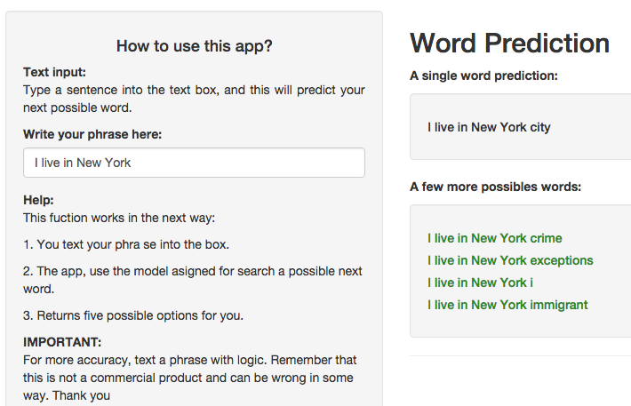

A Simple Word Prediction
========================================================
author: Ian Castiilo Rosales
date: 08/23/2015
transition: rotate
width: 1024
height: 768

Word Prediction
========================================================

The text prediction has become an increasing challenge in everyday tasks and those that are not.

Here is a simple application for the prediction of a given word phrase, using the knowledge acquired through [Data Science Specialization](http://www.coursera.org/specialization/jhudatascience/1) offered by [Johns Hopkins University](http://www.jhu.edu/).

We will talk about:
- The algorithm
- The Shiny application
- How can you use this app?

Algorithm
========================================================
type: prompt

The base of the algorithm is based in the Markov Property: 

**The prediction of the future is based on exactly n-moments of the past**

Based in this Markov Model, you can think in predict the next word of *"I live in New York"*. The word with the highest chance given this word, will be the best prediction given a specific number of words, for example, 

**P( best word | I live in New York ) = P( best word | New York )**

So, based in this concepts, 
- search for the combination of word that the sample text shows. 
- Calculate the probabilities fo the sentences.
- The algorithm evaluate the best option for your phrase.

Application
========================================================

The application is based in [Shiny](http://shiny.rstudio.com/) (a web application framework for R), with a simple interface, basic analysis of the corpus and a detail explication of the model.

1. In the **Predict!** tab you can find the main reason for the app, a word predictor. 
2. **About the Corpus**, you will see basic statistics of the documents used to train the model.  
3. At the **Model** tab you can see a very specific explication of the model.
4. Finally, in the **More** tab, you can finf info about me and this presentation.

So, how does it work?
========================================================

The use of the single word predictor is really easy, you only need *wait a few seconds to the application charge* and then, you can type a phrase...  

Reactively, **you can see a couple of word predictions of your phrase**, highlighting the first (or the best) option for you.

